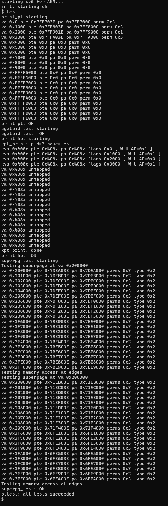

# Explanation of Output

### 1. `print_pt starting`

This prints the **user process page table entries** (PTEs) for the test process.

#### Example line:

```
va 0x0 pte 0x7FF703E pa 0x7FF7000 perm 0x3
```

* **va** → Virtual address being checked (here `0x0`, the start of the process address space).
* **pte** → Raw Page Table Entry value (hardware encoding of mapping + flags).
* **pa** → Physical page address extracted from `pte` (`PT_ADDR(pte)`).
* **perm** → Access permission bits (`PTE_AP(pte)`), decoded from ARMv6 AP field:
  * `0x0` → no access
  * `0x1` → kernel RW, user NA
  * `0x2` → kernel RW, user R-only
  * `0x3` → kernel RW, user RW

So:

* `0x7FF703E` maps virtual `0x0` → physical `0x7FF7000`, with user RW permission.
* The next entries show similar mappings until `0x4000`, after which entries are unmapped (`pte=0`).

**

#### This means only the first few user pages (text, data, stack) are allocated; the rest are not.**

---

### 2. `ugetpid_test starting`

Your custom system call test runs. Since it passes, we see:

```
ugetpid_test: OK
```

It confirms you can invoke a syscall and return per-process state.

---

### 3. `print_kpt starting`

This prints the **kernel page table** (`kpgdir`).

Example line:

```
kva 0x%08x pte 0x%08x pa 0x%08x flags 0x0 [ W U AP=0x1 ]
```

Here, `kva` = kernel virtual address. The rest (pte, pa, flags, AP bits) are formatted values.
The `[ W U AP=0x1 ]` part is a human-readable decode:

* **W** → writable
* **U** → user-accessible
* **AP=0x1** → kernel RW / user NA

After the first few kernel mappings, the rest are `unmapped` → no page table entry (pte=0).

---

### 4. `superpg_test starting`

This tests **superpage allocation** (contiguous 2MB chunk = 512 × 4KB pages).

Example line:

```
va 0x200000 pte 0x7DEA03E pa 0x200000 perms 0x3 type 0x2
```

* **va** → start of the superpage (aligned at 2MB).
* **pte** → raw entry value.
* **pa** → physical page address. You can see it increments contiguously:
  * `0x200000`, `0x201000`, `0x202000`, …
* **perms** → user/kernel access bits (same as before).
* **type** → entry type bits (`PE_TYPES` mask):
  * `0x2` → small 4KB page
  * `0x1` → coarse page table
  * `0x0` → invalid

So here, the test is checking that:

1. Physical pages are contiguous.
2. Permissions are consistent.
3. Memory can be written & read back.

It does this both in the parent and child (`fork`) process.

The fact that it prints the **first 10 and last 10 entries** confirms your truncation logic is working.

---

### 5. `superpg_test: OK`

Everything succeeded: the pages were mapped, verified, and accessible.

---

### 6. `pttest: all tests succeeded`

This is your final integration test summary.

---

## Screenshot of image



---

## Conclusion

The tests demonstrate correct:

* User & kernel page table setup
* Mapping verification (first & last pages)
* Superpage contiguity and memory access

All tests passing (`pttest: all tests succeeded`) confirms the MMU and page table code are working as expected.

---

